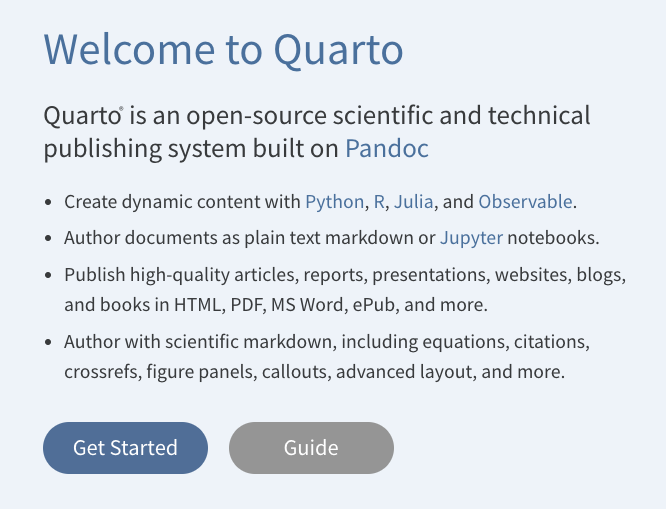

# Quarto

[{fig-align="center"}](https://quarto.org/)

> Quarto is an open source scientific and technical publishing system that supports the integration of data input, manipulation, analyses, and technical descriptions of scientific writings in a single document context. Quarto allows the same source file to create manuscripts (doc & pdf), web pages, presentations (powerpoint & revealjs), posters, etc.

## Student Learning Objectives

It is intended that individuals who complete the work in this repository will be able to:

1. *Create a new quarto document in RStudio.*
1. *Knit default instances of each document type.*

## Content

To describe quarto, the following resrouces are available.

-   [Slides](https://dyerlabteaching.github.io/Quarto/slides.html) - The slides describing the quarto system.
-   [In Class Activity](https://dyerlabteaching.github.io/Quarto/in-class.html) - A short in-class activity to explore some of the more dynamic aspects of this topic.

### External Resources

In addition, the following external resources may be helpful.

- The Quarto [website](https://quarto.org) for downloading the binaries for your computer.
- The Quarto [guide](https://quarto.org/docs/guide/) that discribes the basics for all types of authoring.
- A general [Cheat Sheet](https://github.com/rstudio/cheatsheets/raw/main/rmarkdown.pdf) for RMarkdown.
